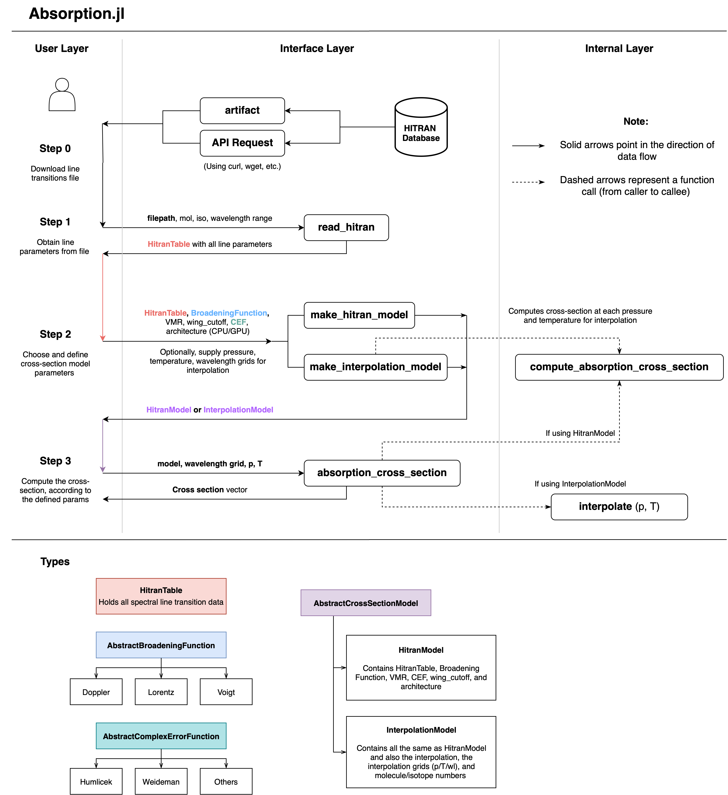

# Absorption Module Overview

This module enables absorption cross-section calculations of atmospheric gases at different pressures, temperatures, and broadeners (Doppler, Lorentzian, Voigt). It uses the [HITRAN](https://hitran.org) energy transition database for calculations. 

While it enables lineshape calculations from scratch, the module also allows users to create and save an interpolator object at specified wavelength, pressure, and temperature grids. 

The module also supports auto-differentiation (AD) of the profile, with respect to pressure and temperature. Calculations can be computed either on CPU or GPU (CUDA). 

Users can calculate an absorption cross-section in a few simple steps: 

0. First, download HITRAN line transitions file either using [`artifact`](@ref), or manually
1. Use [`read_hitran`](@ref) to read in the HITRAN database file 
2. Use [`make_hitran_model`](@ref) or [`make_interpolation_model`](@ref) to set up model parameters for the cross-section calculation
3. Use [`absorption_cross_section`](@ref) to perform the cross-section calculation using the defined model settings

For a full demo of how to use this module, please see the [example](https://remotesensingtools.github.io/vSmartMOM.jl/dev/pages/Absorption/Example.html) page. 

## Architecture

The Absorption.jl architecture closely follows the user's workflow to calculate the absorption cross-section. There are functions for loading a HITRAN line-list, defining profile parameters, and performing the calculation. 

Please note that calculating an absorption cross-section from scratch and creating an interpolation model relies on the same underlying `compute_absorption_section` function. This is where the main broadening equations are implemented. The interpolation model simply calls this function for all points on the pressure-temperature grids, and produces the interpolator object. This function was mainly designed for internal use, so users should generally use the [`absorption_cross_section`](@ref) function instead. 